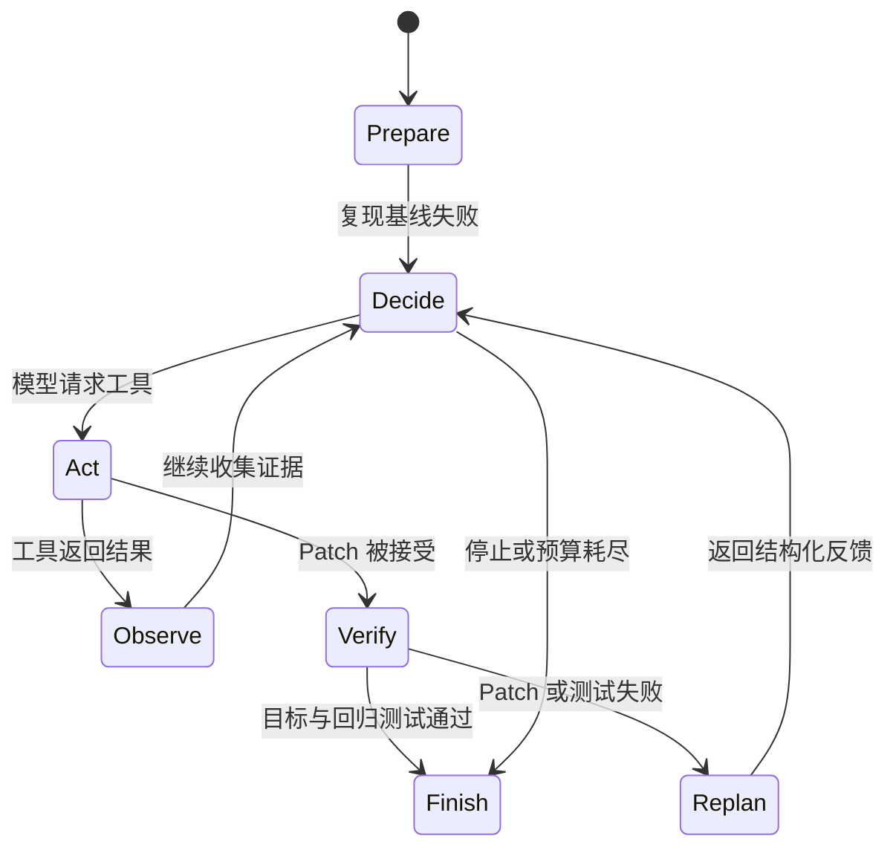

# RepoSuture

RepoSuture 是一个面向 Java/Maven 自动修复、以真实测试为裁决依据的软件工程 Agent。

[](https://github.com/whytomato/RepoSuture/actions/workflows/ci.yml)

模型负责观察仓库并选择工具；RepoSuture 负责隔离、执行、回滚和验证。只有固定目标测试与回归测试均通过，且仓库与产物完整性检查成功，运行结果才会是 `RESOLVED`。模型自己的结论不能代替测试证据。

## Agent 运行示例

下面是 Release 0.4 中一次经过脱敏的 DeepSeek 真实轨迹。内容不包含源码、Patch 正文、凭据或隐藏推理。

```text
[PREPARE] Case=commons-beanutils-nondouble-number commit=e3cafd3
[VERIFY]  基线目标测试 ............................... FAIL

[ACTION]  Agent 搜索并读取相关源码
[ACTION]  apply_patch attempt=1
[VERIFY]  目标测试 ................................... FAIL
[REPLAN]  候选改动已回滚；测试证据返回 Agent

[ACTION]  apply_patch attempt=2
[VERIFY]  目标测试 ................................... FAIL
[REPLAN]  候选改动已回滚；测试证据返回 Agent

[ACTION]  apply_patch attempt=3
[OBSERVE] Patch 被生产文件策略拒绝
[REPLAN]  结构化拒绝信息返回 Agent

[ACTION]  apply_patch attempt=4
[VERIFY]  目标测试 ................................... PASS
[VERIFY]  回归测试 ................................... PASS
[FINISH]  RESOLVED
```



核心安全边界：

- 每次尝试都从固定 Commit 创建全新的 detached Git worktree；
- Agent 只能调用六个严格 Schema 的工具，不能执行任意 Shell 命令；
- Patch 只能修改生产 Java 文件，并依次通过路径、操作、策略和 Git 适用性检查；
- 验证失败的候选改动会在下一轮模型调用前完整回滚；
- `RESOLVED` 只由真实 Git、Maven、JUnit 和完整性证据决定。

快速开始：

```powershell
python -m pip install -e ".[dev]"
python benchmarks/bootstrap_fixture.py

reposuture repair benchmarks/cases/null-email-agent.yaml `
  --artifacts-dir .artifacts-repair `
  --trace-view compact `
  --no-color

reposuture replay-run .artifacts-repair/<run-id> `
  --view verbose `
  --format text `
  --no-color
```

`replay-run` 完全离线：不会请求模型、修改 Git 仓库或执行 Maven。

## 为什么它是 Agent

RepoSuture 不是固定步骤的补丁脚本。每一轮由模型根据当前观察动态选择工具：

| 工具 | 作用 |
|---|---|
| `list_files` | 查看受限范围内的仓库结构 |
| `search_code` | 搜索生产代码 |
| `read_file` | 读取有界源码片段 |
| `apply_patch` | 提交经过策略校验的 Git 风格 Patch |
| `run_target_test` | 请求执行锁定的目标测试 |
| `git_diff` | 查看有界候选差异 |

工具结果会回到同一段对话。Patch 拒绝、目标测试失败、回归失败和候选回滚都可能改变模型的下一步动作。循环只会在确定性验证成功，或模型停止、API 失败、策略拒绝、基础设施失败、预算耗尽等有界条件下结束。

职责始终分离：

- 模型：选择观察与修改动作；
- 环境：执行工具、限制路径、应用事务、运行测试、回滚、记录证据；
- 验证器：独立决定最终状态。

## 0.4 版最终证据

0.4 版在七个 Apache Commons 仓库的八个锁定 Java/Maven Bug 上完成了真实评估。全部运行使用同一干净 Commit：
`e3cafd30edec3802c6bf88177e9c6a702e9c7e03`。

### 真实缺陷修复评估

| 模型 | 分配尝试 | Provider 接受 | 进入模型执行 | `RESOLVED` |
|---|---:|---:|---:|---:|
| `z-ai/glm-5.2` | 14 | 14 | 14 | **12** |
| `deepseek/deepseek-v4-pro` | 14 | 14 | 14 | **11** |
| 合计 | 28 | 28 | 28 | **23** |

原有三个 Bug 每个模型运行三次；新增五个 Bug 每个模型运行一次，用于广度观察。没有用额外尝试替换失败结果。

### 测试反馈消融

| DeepSeek 模式 | 分配尝试 | 目标测试 PASS | 回归 PASS | `RESOLVED` |
|---|---:|---:|---:|---:|
| `full-agent` | 6 | 6 | 6 | **6** |
| `single-candidate-no-feedback` | 6 | 4 | 3 | **3** |

消融实验只改变一件事：Patch 后的验证结果能否返回模型，以及模型能否在既有预算内继续提交候选。两种模式使用完全相同的仓库、工具、Patch 策略、测试和正确性判据。

这些数据是描述性工程证据：

- 原有 Bug 的三次重复仍是小样本；
- 新增 Bug 与每种消融模式都只有一次观察；
- 结果不是 pass@k，也不能证明对任意 Java 项目都有效；
- 消融结果不能单独建立统计或因果结论。

完整报告：

- [GLM-5.2 与 DeepSeek V4 Pro 真实缺陷评估](docs/results/reposuture-real-v2-glm-deepseek.md)
- [DeepSeek 测试反馈消融](docs/results/reposuture-feedback-ablation-deepseek.md)
- [真实缺陷基准来源与构造](docs/REAL_WORLD_BENCHMARK.md)

### 指标口径

- 系统端到端解决率：`resolved / assigned`
- Provider 接受率：`provider accepted / assigned`
- 模型能力解决率：`resolved / model executed`

如果没有任何模型响应进入 Agent 循环，能力解决率及其 Wilson 区间记为 `N/A`，而不是 0%。报告还分别保存：

- `terminal_status`：运行如何结束；
- `primary_failure`：证据支持的主要原因；
- `observed_failures`：按顺序去重的全部失败事件。

## 常用命令

| 命令 | 用途 | 是否需要模型或网络 |
|---|---|---|
| `reposuture verify-case CASE` | 确定性复现并验证单个 Case | 否 |
| `reposuture repair CASE` | 执行一次真实 Agent 修复 | 是 |
| `reposuture validate-benchmark SUITE` | 使用隐藏验证证据校验整个基准 | 不需要模型 |
| `reposuture benchmark SUITE` | 顺序执行单模型批量评估 | 取决于 Provider |
| `reposuture benchmark-matrix SUITE` | 交错执行跨模型评估 | 取决于 Provider |
| `reposuture benchmark-ablation SUITE` | 比较完整 Agent 与无反馈模式 | 取决于 Provider |
| `reposuture replay-run PATH` | 离线重放已完成的脱敏轨迹 | 否 |

OpenRouter 兼容配置示例：

```powershell
$env:OPENAI_API_KEY = "<your-api-key>"
$env:OPENAI_BASE_URL = "https://openrouter.ai/api/v1"
$env:REPOSUTURE_MODEL = "<provider/model-id>"

reposuture repair benchmarks/cases/null-email-agent.yaml `
  --artifacts-dir .artifacts-live
```

真实模型命令会消耗 API 配额并可能产生费用。RepoSuture 不硬编码模型价格。不要提交 `.env` 或生成的运行产物。

离线编排测试可使用 scripted Provider。它不代表模型能力，但仍会真实执行 Git、Patch、Maven、JUnit、目标测试、回归测试和报告生成：

```powershell
reposuture benchmark benchmarks/suites/mvp.yaml `
  --artifacts-dir .artifacts-scripted `
  --provider scripted `
  --runs-per-case 1
```

## 验证与产物

Patch 被接受后，RepoSuture 会自动：

1. 执行锁定的目标测试；
2. 目标测试通过后执行配置的回归范围；
3. 验证失败时回滚候选，再允许重新规划；
4. 检查最终 Git diff 和原始仓库完整性；
5. 写入并校验运行产物。

每次运行可生成：

- `report.json`：确定性状态、验证证据与指标；
- `trace.jsonl`：唯一权威的脱敏事件流；
- `trajectory.md`：由同一事件流生成的人类可读轨迹；
- `final.patch`：成功运行的最终差异；
- 有界的基线、目标测试与回归日志。

报告不会写入 API Key、Authorization Header、完整环境变量、隐藏推理或隐藏基准答案。

## 开发与验证

要求：

- Python 3.11+
- Git
- Java 17
- Maven 或仓库内 Maven Wrapper

质量门：

```powershell
python -m pytest -q
python -m ruff check .
python -m mypy src
```

确定性基准验证：

```powershell
reposuture validate-benchmark benchmarks/suites/mvp.yaml `
  --artifacts-dir .artifacts-validation
```

默认测试与 CI 不需要模型 API Key。第三方源码、重建仓库与 Maven 输出只保存在被忽略的缓存目录中。

## 当前范围与限制

目前支持：

- 具有现成、确定性 JUnit 测试的 Java 17 Maven 项目；
- 每个 Case 一段同步 Agent 对话；
- 对 `src/main/java/**/*.java` 提交文本 Unified Diff；
- 顺序基准执行；
- 通过统一客户端接入 OpenAI-compatible Responses API。

目前不支持任意仓库、Gradle、Shell、自动测试生成、多 Agent、MCP、RAG、LSP、EvoMaster 或 Web UI。模型版本、Provider 状态、依赖缓存、操作系统、Java/Maven 版本和硬件都会影响复现。

## 文档

- [Agent Runtime](docs/AGENT_RUNTIME.md)
- [基准设计、指标与失败分类](docs/BENCHMARK.md)
- [真实缺陷基准来源](docs/REAL_WORLD_BENCHMARK.md)
- [Release 0.4 发布记录](docs/EXEC_PLAN.md)
- [第三方声明](THIRD_PARTY_NOTICES.md)
- [安全策略](SECURITY.md)

## 从 PatchPilot 更名

项目因避免与另一个软件补丁项目重名而更名，双方没有关联。当前 Python distribution、package 与主 CLI 均为 `reposuture`。弃用别名 `patchpilot` 暂时仍会转发到同一实现，并输出一次迁移警告。

## 许可证

[MIT](LICENSE)
