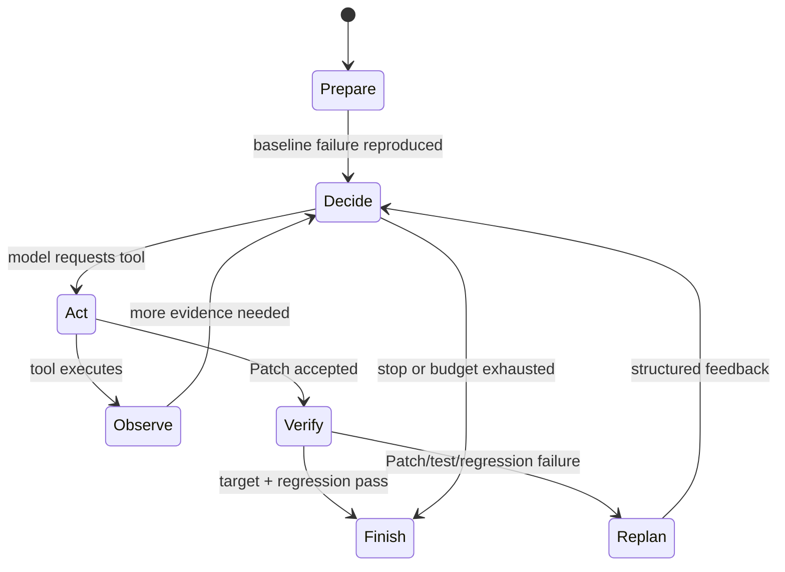
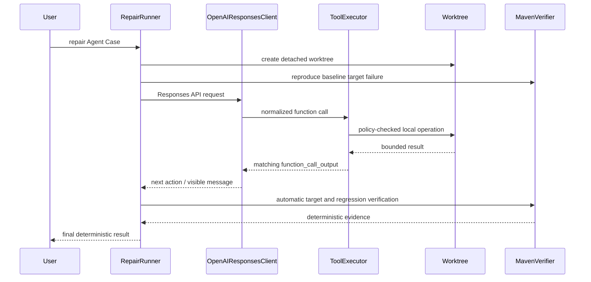

# RepoSuture

RepoSuture is a test-grounded Software Engineering Agent for autonomous Java/Maven bug repair.

[](https://github.com/whytomato/RepoSuture/actions/workflows/ci.yml)

它让模型动态选择受限的软件工程工具，同时把正确性完全交给隔离 Git worktree、Maven、
JUnit、目标测试、完整回归和仓库完整性检查。模型的文字声明永远不能产生 `RESOLVED`。

## Agent in action

下面是 scripted regression-trap 的真实 harness 轨迹摘要；它展示反馈循环，不代表 live 模型能力：

```text
[PREPARE] Creating isolated worktree at commit d54d13bf
[VERIFY]  Baseline target test ........................ FAIL
[TURN 1/12] DECIDE
[ACTION]  apply_patch patch_size=434
[OBSERVE] Patch attempt 1 accepted; 1 production file changed
[VERIFY]  Target test (Patch 1) ....................... PASS
[VERIFY]  Regression suite (Patch 1) .................. FAIL
[REPLAN] Candidate reverted; regression diagnostic returned to Agent
[TURN 2/12] DECIDE
[ACTION]  apply_patch patch_size=554
[VERIFY]  Target test (Patch 2) ....................... PASS
[VERIFY]  Regression suite (Patch 2) .................. PASS
[FINISH]  RESOLVED
```

完整的已清洗实跑文档见
[`docs/examples/scripted-regression-trap-trajectory.md`](docs/examples/scripted-regression-trap-trajectory.md)，
运行时职责与边界见 [`docs/AGENT_RUNTIME.md`](docs/AGENT_RUNTIME.md)。

首次 clean live 六 Case 评估及其单次运行限制见
[`docs/results/openrouter-glm-5.2-live-r1.md`](docs/results/openrouter-glm-5.2-live-r1.md)；
真实 Patch 拒绝 → REPLAN 示例见
[`docs/examples/live-pagination-replan-trajectory.md`](docs/examples/live-pagination-replan-trajectory.md)。
Release 0.3 的重复两模型 MVP 结果见
[`docs/results/reposuture-mvp-two-model-r3.md`](docs/results/reposuture-mvp-two-model-r3.md)，
真实上游 Java Bug 结果见
[`docs/results/reposuture-real-world-r1.md`](docs/results/reposuture-real-world-r1.md)。



关键安全属性：每次运行使用固定 commit 的全新隔离 worktree；只有六个严格 schema 工具；
Patch 必须通过路径、操作、生产文件策略和 `git apply --check`；失败候选会回滚；所有预算有界；
trace、实时视图和 replay 都只使用已清洗事件，不包含 Patch 正文、源码全文、凭据或隐藏推理。

快速开始：

```powershell
conda activate patchpilot
python -m pip install -e ".[dev]"
python benchmarks/bootstrap_fixture.py

reposuture repair benchmarks/cases/null-email-agent.yaml `
  --artifacts-dir .artifacts-live --trace-view compact --no-color

reposuture replay-run .artifacts-live/<run-id> `
  --view verbose --format text --no-color
```

`repair` 的 live provider 会使用 API，可能产生费用；默认测试、确定性验证和 replay 不需要
凭据或网络。首次 Maven Wrapper/依赖下载完成后，fixture 可离线执行。
本地 Conda 环境仍可沿用旧名称 `patchpilot`；它不是发行包或 CLI 名称。

## What makes RepoSuture an Agent?

- 模型根据当前证据动态选择 `list_files`、`search_code`、`read_file`、`apply_patch`、
  `run_target_test` 或 `git_diff`，动作并非完全硬编码序列。
- 每个工具的有界观察会返回同一模型会话；Patch 拒绝、目标失败和回归失败会改变后续动作。
- 接受 Patch 后，环境自动运行确定性验证；失败候选回滚并把结构化证据送回 Agent 继续规划。
- 循环持续到目标与回归都通过，或模型停止、策略/基础设施失败、API 失败或预算耗尽。
- verifier 而不是模型拥有正确性判定；不会展示或重建隐藏 chain-of-thought。

## Milestone history

- Milestone 1：确定性复现固定 commit、应用 validation golden Patch、执行目标和完整回归。
- Milestone 2：provider-independent 单 Agent 工具循环和 Responses API 集成。
- Milestone 3：六 Case Java 17/Maven benchmark、确定性校验、顺序批处理和聚合报告。
- Milestone 4A：安全 Patch normalization、错误 taxonomy、`--recount` 限定回退和事务回滚。
- Milestone 4B：基于 canonical trace 的实时 Agent timeline、离线 replay 和 `trajectory.md`。

Milestone 4B 已作为 commit
`7ee8912ca58225f734484c5139103cb763b77e99` 提交并推送；当时完整验证为 **245 passed**，
确定性 benchmark validation 为 6/6，scripted/offline harness 为 6/6。scripted 结果只证明
Agent 编排、真实 Git/Maven/JUnit 和反馈循环，不是 live 模型修复率。Milestone 5 随后在 clean
commit `944fc6aab83c64848c4eae11f291db80ebc69041` 上完成首次 live 六 Case 评估：单次经验结果为
6/6 `RESOLVED`。这只是每 Case 一次的观测，不是统计稳健的成功率，也不是 pass@k；完整条件与
逐 Case 证据见上述结果文档。

## Stability evaluation

历史 R1 是六个 MVP Case、每 Case 一次、单模型的 **6/6 observation**；它不是
“100% 通用成功率”，也不是 pass@k。Release 0.3 增加三次全新尝试/Case/模型的交错矩阵，
用于观察重复运行稳定性。矩阵预检命令会明确输出
`6 Cases x 3 runs x 2 models = 36 live attempts`，失败的完整尝试也会保留，不能用补跑替换。

```powershell
reposuture benchmark-matrix benchmarks/suites/mvp.yaml `
  --artifacts-dir .artifacts-live-r03-mvp-matrix `
  --provider openai `
  --model z-ai/glm-5.2 `
  --model openai/gpt-5-mini `
  --runs-per-case 3 --schedule interleaved --dry-run
```

## Cross-model comparison

两个模型使用同一 commit、benchmark fingerprint、Case 文本、工具 schema、预算、timeout、
Patch policy、endpoint 和测试 oracle；只有 model id 不同。矩阵报告提供逐尝试/逐 Case 结果、
描述性 95% Wilson 区间、工具协议丢弃率、tokens、latency 和失败 taxonomy。三次尝试仍是小样本，
比较是描述性的，不宣称统计显著性。Release 0.3 实际完成了固定的 36 次 live 尝试：
`z-ai/glm-5.2` 为 18/18 `RESOLVED`，描述性 Wilson 95% 区间为 [0.824, 1.000]；
`openai/gpt-5-mini` 的 18 次请求都在产生工具调用前被上游以 provider Terms of Service 403
拒绝，记录为 0/18 `MODEL_API_ERROR`。因此这不是有效的修复能力胜负比较，也没有补跑失败样本。
完整逐次证据和限制见
[`reposuture-mvp-two-model-r3.md`](docs/results/reposuture-mvp-two-model-r3.md)。

## Real-world benchmark

独立的 `maven-real-world-v1` 套件锁定三条真实 Apache Java/Maven bug（Commons Lang 1 条、
Commons Collections 2 条），覆盖溢出边界、数值转换和集合语义；其中一条涉及两个生产实现。
完整第三方仓库只存在于忽略缓存。设计、上游 URL、许可证、筛选理由和 bootstrap 命令见
[`docs/REAL_WORLD_BENCHMARK.md`](docs/REAL_WORLD_BENCHMARK.md)。固定的
`3 Cases x 1 run x 2 models = 6 attempts` 已真实完成：GLM 5.2 解决 2/3，其中未解决的
Commons Lang 尝试真实经历目标 PASS、回归 FAIL、回滚和重规划后耗尽预算；GPT-5 Mini 的
三次请求仍被相同的上游 403 拒绝。完整结果见
[`reposuture-real-world-r1.md`](docs/results/reposuture-real-world-r1.md)。

## Renamed from PatchPilot

项目为避免与另一个软件补丁项目重名而更名为 **RepoSuture**；与该项目不存在隶属、合作或
关联。Python distribution、package 和主 CLI 均为 `reposuture`。GitHub 旧 URL 在仓库重命名
后应由 GitHub 重定向，但用户仍应更新本地 origin：

```powershell
git remote set-url origin https://github.com/whytomato/RepoSuture.git
```

旧 `patchpilot` CLI 在 0.3 仅作为临时 deprecated alias 转发到同一个实现、保留原退出码并向
stderr 输出一次迁移警告。旧 benchmark report/replay 的 `patchpilot_git_commit` 和
`patchpilot_worktree_dirty` 字段仍可读取；新报告只写中性的 `project_*` 字段。为保持已发布
R1 fingerprint，原六个合成 Java fixture 的 `dev.patchpilot.fixture` namespace 和固定 commit
作为历史基准数据保留，不代表当前 Python 包名。

本项目没有多 Agent、LangChain、LangGraph、OpenAI Agents SDK、MCP、RAG、向量数据库、
Web UI、Docker 编排、LSP、EvoMaster 或自动测试生成，也不会向模型开放任意 Shell。

## 当前范围

- Python 3.11+、Java 17、Maven/Maven Wrapper、JUnit 5
- 本地非 bare Git 仓库与完整 40 字符 commit SHA
- 已存在且可确定复现的目标测试
- Git-style UTF-8 Unified Diff
- 单 Case、单 Agent、同步 Responses API 调用
- 六 Case MVP benchmark、顺序批处理、scripted/offline 编排验证与 live OpenAI 评估
- 隔离 detached Git worktree、结构化 JSON report 与有界 JSONL trace
- OpenAI 官方 Python SDK；本次验证使用 2.46.0，依赖声明为 `openai>=2.46.0,<3`

## 架构

Milestone 1 的 `ProcessRunner`、`GitWorktree`、`MavenRunner`、`PatchApplier` 和报告状态机
仍是安全与确定性底座。Milestone 2 在其上增加 provider-independent `LLMClient`、
`ToolExecutor`、`OpenAIResponsesClient` 与 `RepairRunner`。Milestone 3 只在这两个既有流程上
增加 suite 校验、顺序调度、指纹和聚合报告，没有重写底座或增加 Agent 能力。



Responses 请求使用 `store=False`、`parallel_tool_calls=False`、显式 API timeout、有界重试和
`max_output_tokens`。RepoSuture 手动保留本轮 `response.output`，包括推理模型续接所需的
非工具项；执行工具后使用完全相同的 `call_id` 追加 `function_call_output`。这些 provider
续接项只保存在内存，不会把隐藏推理写入 report 或 trace。

若 OpenAI-compatible endpoint 违反 `parallel_tool_calls=False` 并返回多个调用，RepoSuture
仍保持单动作 Agent 契约：只接受第一个调用，从第二个调用开始截断未执行的 provider 输出，
记录安全的兼容性计数，并在第一个工具 observation 返回后让模型重新决策。后续调用不会被
批量执行，也不会绕过工具预算或验证。

模型可见的工具只有：

1. `list_files`：有深度、数量与忽略目录限制的仓库文件列表。
2. `search_code`：固定字符串、受限文件数/匹配数/字节数的代码搜索。
3. `read_file`：拒绝二进制并限制行窗与字节数的文件读取。
4. `apply_patch`：复用 Unified Diff 路径策略、`git apply --check`、应用和分类逻辑。
5. `run_target_test`：只能运行 Agent Case 中已经验证的目标测试。
6. `git_diff`：返回受限 diff、文件分类和增删行统计。

每个 Responses function schema 都是 `strict=true` 的封闭 object：显式 properties、全部
required、`additionalProperties=false`。API schema 不能替代本地 Pydantic 校验。

## 安装

需要 Python 3.11+、Git 和 Java 17。使用已有 Conda 环境：

```powershell
conda activate patchpilot
python --version
java -version
git --version
python -m pip install -e ".[dev]"
python benchmarks/bootstrap_fixture.py
```

示例 fixture 使用 Apache Maven Wrapper 3.3.4 `only-script`、Maven 3.9.9 和固定分发包
SHA-256 `4ec3f26fb1a692473aea0235c300bd20f0f9fe741947c82c1234cefd76ac3a3c`。
首次运行可能需要下载 Maven 与依赖；Wrapper 下载或 SHA-256 校验失败会报告基础设施错误。

## CLI

Milestone 1 确定性诊断不读取 OpenAI 配置：

```powershell
reposuture verify-case benchmarks/cases/null-email.yaml `
  --artifacts-dir .artifacts
```

真实模型修复需要在当前 PowerShell 进程设置占位符所代表的真实凭据与模型名：

```powershell
$env:OPENAI_API_KEY = "<your-api-key>"
$env:PATCHPILOT_MODEL = "<your-model-name>"

reposuture repair benchmarks/cases/null-email-agent.yaml `
  --artifacts-dir .artifacts-live `
  --trace-view compact
```

`--trace-view compact|verbose|off` 只改变展示，不改变 prompt、工具或预算。`verbose` 增加有界参数、
计数、耗时和错误码；`off` 关闭实时 timeline 但保留最终摘要。`--no-color` 适合重定向与逐字比较。
完成后可在无 API Key、无网络且不运行 Git/Maven 的情况下重放成功或失败轨迹：

```powershell
reposuture replay-run .artifacts-live/<run-id> `
  --view verbose --format text --no-color

reposuture replay-run .artifacts-live/<run-id>/report.json `
  --view verbose --format markdown `
  --output .artifacts-live-replay.md --no-color
```

新生成的 `report.json` 使用 run-directory-relative 工件引用，因此完整移动或复制 run 目录后仍可
replay。Replay 会校验 report/trace schema、sequence、run id、终态、工件 containment、大小和
SHA-256；旧版全绝对路径报告只有在本地文件名、元数据、大小和哈希共同证明身份时才会安全重映射。
任意外部绝对路径、`../`、symlink/junction 逃逸仍会被拒绝。输出路径不得位于原 run 目录内，
因此不会覆盖原始证据。

一次性模型覆盖和预算控制：

```powershell
reposuture repair benchmarks/cases/null-email-agent.yaml `
  --artifacts-dir .artifacts-live `
  --model "<your-model-name>" `
  --max-turns 10 `
  --max-tool-calls 24 `
  --max-patch-attempts 3 `
  --keep-worktree
```

`repair` 会产生 API 费用，并受网络、账户权限、限额与所选模型能力影响。默认 pytest 不会
访问网络或要求 API Key。只有明确设置了 `OPENAI_API_KEY` 和 `PATCHPILOT_MODEL` 时才应运行
上述 live 命令；没有真实执行时不得宣称 live 修复成功。

离线 FakeLLM 验证命令会经过同一个 `RepairRunner`、真实 Git worktree、Maven 和 JUnit，
但 Patch 来自显式测试参数，不会联系 OpenAI，也不代表自主生成能力：

```powershell
python benchmarks/run_fake_repair.py `
  benchmarks/cases/null-email-agent.yaml `
  --patch-file benchmarks/fixtures/null-email-golden.patch `
  --artifacts-dir .artifacts-m2-fake
```

Milestone 3 benchmark 先用隐藏 golden Patch 证明六个 Case 本身有效：

```powershell
reposuture validate-benchmark benchmarks/suites/mvp.yaml `
  --artifacts-dir .artifacts-benchmark-validation
```

离线 scripted 模式仍执行真实 `ToolExecutor`、Git worktree、Patch、Maven/JUnit、目标测试和
完整回归；只有模型动作是固定脚本。它只验证 harness，不能作为模型能力数据：

```powershell
reposuture benchmark benchmarks/suites/mvp.yaml `
  --artifacts-dir .artifacts-benchmark-scripted `
  --provider scripted `
  --runs-per-case 1
```

live 模式为每个 Case 建立全新的 OpenAI 会话和 worktree，默认顺序执行且失败后继续：

```powershell
$env:OPENAI_API_KEY = "<your-api-key>"
$env:PATCHPILOT_MODEL = "<your-model-name>"

reposuture benchmark benchmarks/suites/mvp.yaml `
  --artifacts-dir .artifacts-benchmark-live `
  --provider openai `
  --runs-per-case 1
```

可重复使用 `--case <id>` 过滤 Case，并可覆盖 turns、tool calls、Patch、目标测试、回归和总时长
预算；`--random-seed` 只记录 provider 适用时的元数据，不伪造确定性。live 调用会使用 API，
可能产生费用。RepoSuture 不使用硬编码价格计算成本。

MVP 的六类缺陷为 null 输入验证、分页边界、enum/status 过滤、条件/布尔逻辑、字符串规范化，
以及可令目标通过但破坏回归的 trap。每个 Case 都有至少一个非目标回归测试；其中两个 Case
要求在相关的两个生产文件间导航。设计、指标和新增 Case 步骤见
[`docs/BENCHMARK.md`](docs/BENCHMARK.md)。

逐次报告记录 baseline、目标与回归结果、模型轮数、按工具名计数、Patch 尝试与拒绝、测试
执行次数、provider 暴露的 token、模型请求/API 错误、墙钟/模型/测试耗时、文件与增删行、
完整性检查及确定性失败分类。聚合报告给出原始经验成功率、平均值和中位数、逐 Case 成功率、
工具分布与失败分析；原始经验率不称为 `pass@k`。`scripted/offline` 与 `live model` 永不混入
同一能力聚合。

`verify-case` 和 `repair` 仅在 `RESOLVED` 时返回 0。benchmark 使用一致的批处理退出策略：
至少一次确定性解决返回 0（其余失败仍保留在报告）；suite 无效返回 2；没有可执行尝试或批次
基础设施失败返回 3；尝试均执行但零解决返回 4。`validate-benchmark` 仅在全部 Case 有效时返回
0。精确定义和失败 taxonomy 见 benchmark 文档。

## Milestone 4A: model Patch ingestion

Milestone 4A hardens the existing `apply_patch` boundary; it does not add Agent
capabilities. Model text still cannot produce `RESOLVED`: Git, Maven, JUnit, the target
test, the full regression suite, repository integrity, and artifact checks remain the
only authorities.

The initial single-Case OpenRouter smoke was an engineering finding, not a model
resolution-rate result. With endpoint `https://openrouter.ai/api/v1`, model
`z-ai/glm-5.2`, and the existing two-Patch-attempt budget, the real baseline failed as
expected and three API requests completed without API errors. The model made one
`read_file` call and two `apply_patch` calls. The first Patch lacked `diff --git`; the
second was rejected by Git as `corrupt patch at line 12`. Both were safely rejected,
neither target nor regression tests ran afterward, no worktree change survived, and no
false `RESOLVED` was produced. The run ended `AGENT_BUDGET_EXHAUSTED`. This result must
not be aggregated as a model capability rate.

Model Patch ingestion now records raw and normalized SHA-256 values and every applied
normalization. The only permitted transformations are newline normalization, UTF-8 BOM
removal, removal of one whole-argument Markdown Patch fence, removal of blank lines
outside the Patch, exactly one final newline, and one narrow synthesized `diff --git`
header. Header synthesis requires exactly one existing production Java file and matching
`--- a/<path>` / `+++ b/<path>` headers. Paths are never inferred from issue text, prior
tool calls, hunks, or hidden benchmark data.

RepoSuture does not repair source text, context lines, hunk prefixes, paths, create/delete
operations, rename/copy metadata, binary data, mode changes, test/build/CI changes, or
ambiguous multi-file headers. It always tries strict `git apply --check` first. Only after
structural and policy checks pass may it try one `git apply --check --recount`; a successful
recount means hunk line counts were inaccurate, not that arbitrary malformed content was
repaired. Application uses the exact normalized bytes checked by Git and rolls back on
any post-apply failure.

Patch rejection feedback contains a bounded stable code, Git/policy diagnostic,
required format, safety rules, normalization evidence, `worktree_modified=false`, and
the exact remaining Patch-attempt budget. Codes include `PATCH_EMPTY`,
`PATCH_ENCODING_INVALID`, `PATCH_FENCE_INVALID`, `PATCH_GIT_HEADER_MISSING`,
`PATCH_FILE_HEADERS_MISSING`, `PATCH_PATH_MISMATCH`, `PATCH_PATH_UNSAFE`,
`PATCH_OPERATION_UNSUPPORTED`, `PATCH_POLICY_REJECTED`, `PATCH_HUNK_INVALID`,
`PATCH_GIT_CHECK_FAILED`, `PATCH_GIT_RECOUNT_FAILED`, `PATCH_APPLICATION_FAILED`,
`PATCH_POST_APPLY_FAILED`, and `PATCH_ROLLBACK_FAILED`.

OpenRouter uses the existing OpenAI-compatible Responses adapter; it is not a new
RepoSuture provider implementation. Configure only the documented variables:

```powershell
$env:OPENAI_API_KEY = "<your-openrouter-api-key>"
$env:OPENAI_BASE_URL = "https://openrouter.ai/api/v1"
$env:PATCHPILOT_MODEL = "z-ai/glm-5.2"
```

The CLI provider selector remains `--provider openai`, while live reports identify the
actual endpoint provider as `openrouter`. The clean before/after smoke uses the same Case,
model, and two-attempt budget:

```powershell
reposuture benchmark benchmarks/suites/mvp.yaml `
  --artifacts-dir .artifacts-openrouter-smoke-m4a `
  --provider openai `
  --case null-input-validation `
  --runs-per-case 1 `
  --max-patch-attempts 2
```

Run this only with genuine credentials. It consumes API quota and may cost money. Never
commit `.env` or generated artifacts. At that historical point the improvement was not yet
claimed successful. A later clean R1 evaluation exercised the hardened ingestion path and
resolved all six single attempts, while remaining explicitly non-statistical. Release 0.3's
fresh three-run-per-Case experiment is the first stability-oriented follow-up and does not
combine those historical R1 observations.

## Case 格式

Milestone 1 schema v1 含仅供基础设施验证的 golden Patch：

```yaml
schema_version: 1
id: null-email
repository: ../fixtures/null-email-repo
base_commit: edd183a37038d966afca53e94e8d8819fc508bb8
issue_title: Reject null email during user registration
issue_description: Registration must reject null email with InvalidEmailException.
target_test:
  class_name: dev.patchpilot.fixture.UserRegistrationServiceTest
  method_name: shouldRejectNullEmail
target_test_timeout_seconds: 180
regression_timeout_seconds: 300
golden_patch: ../fixtures/null-email-golden.patch
expected_baseline_failure: test_failure
```

Milestone 2 schema v2 与 v1 严格分离，不能包含 `golden_patch`：

```yaml
schema_version: 2
workflow: agent_repair
id: null-email-agent
repository: ../fixtures/null-email-repo
base_commit: edd183a37038d966afca53e94e8d8819fc508bb8
issue_title: Reject null email during user registration
issue_description: Registration must reject null email with InvalidEmailException.
target_test:
  class_name: dev.patchpilot.fixture.UserRegistrationServiceTest
  method_name: shouldRejectNullEmail
target_test_timeout_seconds: 180
regression_timeout_seconds: 300
expected_baseline_failure: test_failure
agent_budgets:
  max_model_turns: 12
  max_tool_calls: 30
  max_patch_attempts: 4
  max_target_test_executions: 8
  max_regression_executions: 4
  max_wall_clock_seconds: 1800
  api_timeout_seconds: 60
  api_max_retries: 2
  max_output_tokens: 4096
  max_retained_model_output_bytes: 65536
  max_retained_tool_output_bytes: 65536
allowed_file_policy:
  production_java_only: true
```

目标测试只由 class/method 数据构成，转换为参数数组中的
`-Dtest=ClassName#methodName`；Case 和模型均不能提供 Maven 参数、环境变量或 Shell 字符串。

## 确定性验证策略

`repair` 在第一次模型调用前必须用 Surefire XML 证明指定目标测试真实执行且失败。编译失败、
依赖错误、测试不存在、零测试、跳过、超时或 JVM/进程基础设施错误都不是有效 baseline。

每次 `apply_patch` 成功后，harness 不等待模型请求，立即：

1. 运行同一个目标测试；
2. 目标通过后运行完整默认 Maven `test` 回归；
3. 失败时把紧凑诊断返回模型，并把候选恢复到固定 commit baseline；
4. 后续 Patch 必须是相对 baseline 的完整候选；等价 Patch 会被拒绝；
5. 目标和回归都通过后校验最终 diff 未在测试中变化，再由状态机判定结果。

`RESOLVED` 同时要求 baseline 真实失败、非空生产 Java Patch、目标真实通过、完整回归真实
通过、原仓库前后指纹相同、artifacts 写入成功，并且 worktree 清理符合配置。模型输出
“fixed”或“success”没有任何判定权。

## Artifacts 与状态

每次运行在 `--artifacts-dir` 下创建唯一目录：

- `report.json`：原子写入的状态、Git/Test/Patch 证据及 Agent telemetry。
- `trace.jsonl`：递增 sequence、UTC 时间戳和经过限制/脱敏的 Agent 事件。
- `final.patch`：成功候选对应的最终 `git diff --binary`；未解决时不得作为成功证据。
- `baseline-target-test.log`：baseline Maven/JUnit 完整有界日志。
- `patched-target-test.log`：每次候选目标测试日志，带尝试分隔符。
- `regression-test.log`：每次完整回归日志，带尝试分隔符。
- `trajectory.md`：从同一 canonical `trace.jsonl` 派生的安全 Agent 时间线、验证证据和指标；
  不嵌入 Patch 正文或隐藏推理。

Agent report 还记录 provider/model、模型轮数、工具调用总数及按名称计数、Patch 尝试数、目标与
回归执行次数、输入/输出/推理 token 数（SDK 提供时）、API request ID、模型延迟、最终可见
消息和最终确定性状态。API Key、Authorization header、完整环境变量和隐藏推理不会被记录。

状态包括 Milestone 1 的 `INVALID_CASE`、`INFRASTRUCTURE_ERROR`、
`BASELINE_NOT_REPRODUCED`、`PATCH_REJECTED`、`TARGET_TEST_FAILED`、
`REGRESSION_FAILED`、`RESOLVED`，以及 Agent 的 `MODEL_CONFIGURATION_ERROR`、
`MODEL_API_ERROR`、`MODEL_STOPPED`、`AGENT_BUDGET_EXHAUSTED`、`POLICY_REJECTED`、
`UNRESOLVED`。

## 安全设计

- 全仓库禁止 `shell=True` 和 `os.system`；所有 subprocess 使用参数数组、显式 cwd、超时、
  有界 stdout/stderr 与结构化结果。
- 超时终止整个 POSIX 进程组或 Windows 进程树，避免遗留 Maven/Java/cmd。
- 所有修改仅发生在唯一 detached worktree；运行前后的原仓库 HEAD、index、tracked、
  untracked、模式和内容指纹必须一致。
- 路径 containment 使用解析后的路径关系，拒绝绝对路径、Windows drive/UNC、反斜杠、
  `..`、符号链接/junction/reparse point 和 `.git` 元数据路径。
- Agent Patch 只能改 `src/main/java/**/*.java`。测试、`pom.xml`、`.mvn`、`mvnw*`、CI、
  文档和其他文件在 Git 应用前即被策略拒绝，不会留下部分修改。
- Patch 内容在内存中冻结；同一字节流通过 stdin 交给 `git apply --check` 和 `git apply`，
  affected files 最终以真实 Git diff 为准。
- OpenAI SDK 内部重试被禁用；RepoSuture 只有限重试连接、timeout、rate limit、408/409/429
  和服务端错误。认证、无效请求、无效 schema 与不支持模型不会反复重试。
- artifacts 目录不能位于原仓库内；Trace 对 token/password/secret/authorization/environment
  等键脱敏，模型 Patch 正文只以大小和 SHA-256 出现在 Trace 元数据中。

## 测试与复现

```powershell
python -m pytest -q
python -m ruff check .
python -m mypy src
reposuture validate-benchmark benchmarks/suites/mvp.yaml `
  --artifacts-dir .artifacts-benchmark-validation
reposuture benchmark benchmarks/suites/mvp.yaml `
  --artifacts-dir .artifacts-benchmark-scripted --provider scripted
```

默认测试通过注入式假 SDK 覆盖 Responses API 协议，不使用网络。FakeLLM Agent 集成测试不会
Mock `ToolExecutor`、Git、Patch、Maven、Java、JUnit、目标测试或回归验证；环境确实没有 Java
时才允许用明确原因 skip。

可单独运行核心真实流程：

```powershell
python -m pytest tests/test_repair_runner.py -q -s
```

## 已知限制与下一阶段

- 仅支持标准单模块 Maven/Surefire `target/surefire-reports` 布局和已有 JUnit 5 测试。
- 同步单 Agent；没有流式 UI、并行工具调用、会话持久化或跨 Case 记忆。
- MVP 只有六个小型人工策展 Case，不代表所有 Java 项目、框架或缺陷分布；跨机器还会受 OS、
  Java/Maven 版本、依赖缓存和硬件影响。
- Agent 候选仅限文本 Unified Diff；不支持 quoted 特殊路径、rename/copy、binary、symlink 或
  submodule Patch。
- 首次 Maven 下载与 live OpenAI 调用需要网络；模型行为、费用、配额和服务可用性不确定。
- `--keep-worktree` 会保留调试目录，需要用户之后自行处理。
- Windows/Conda 的旧 GBK shell 可能因既有 PATH 字符在 `conda activate` 时失败；可使用
  `conda run -n reposuture ...`，不影响标准 `python -m ...` 用法。

下一阶段建议是基于真实、明确执行的 live 结果加固评估与 provider 可恢复性，而不是开始多
Agent、MCP、RAG、自动测试生成、EvoMaster、LSP 或 UI 工作。
