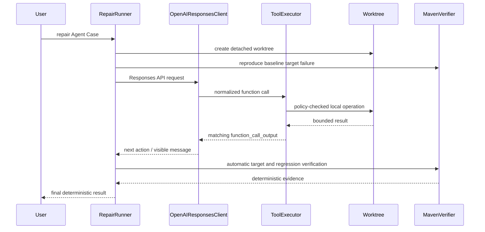

# PatchPilot

PatchPilot 是面向 Java Maven 项目的测试驱动 Bug 修复工具。它把模型生成候选 Patch
与最终判定严格分离：模型只能通过受限工具观察和修改隔离 worktree；只有真实
Maven/JUnit 证据能够产生 `RESOLVED`。

当前包含两个可并存的工作流：

- Milestone 1 — deterministic execution environment：复现固定 commit 上的目标测试失败，
  应用 Case 中的 golden Patch，再运行目标测试和完整回归。命令为 `verify-case`，无需
  API Key。
- Milestone 2 — Agent runtime foundation 与 OpenAI Responses API repair：单个模型通过六个
  PatchPilot 自定义工具提出生产代码 Patch；harness 在每次接受 Patch 后自动验证。命令为
  `repair`。

本项目没有多 Agent、LangChain、LangGraph、OpenAI Agents SDK、MCP、RAG、向量数据库、
Web UI、Docker 编排、LSP、EvoMaster 或自动测试生成，也不会向模型开放 Shell、
`local_shell`、computer-use、code-interpreter、file-search 或内置 apply-patch 工具。

## 当前范围

- Python 3.11+、Java 17、Maven/Maven Wrapper、JUnit 5
- 本地非 bare Git 仓库与完整 40 字符 commit SHA
- 已存在且可确定复现的目标测试
- Git-style UTF-8 Unified Diff
- 单 Case、单 Agent、同步 Responses API 调用
- 隔离 detached Git worktree、结构化 JSON report 与有界 JSONL trace
- OpenAI 官方 Python SDK；本次验证使用 2.46.0，依赖声明为 `openai>=2.46.0,<3`

## 架构

Milestone 1 的 `ProcessRunner`、`GitWorktree`、`MavenRunner`、`PatchApplier` 和报告状态机
仍是安全与确定性底座。Milestone 2 在其上增加 provider-independent `LLMClient`、
`ToolExecutor`、`OpenAIResponsesClient` 与 `RepairRunner`，没有重写底座。



Responses 请求使用 `store=False`、`parallel_tool_calls=False`、显式 API timeout、有界重试和
`max_output_tokens`。PatchPilot 手动保留本轮 `response.output`，包括推理模型续接所需的
非工具项；执行工具后使用完全相同的 `call_id` 追加 `function_call_output`。这些 provider
续接项只保存在内存，不会把隐藏推理写入 report 或 trace。

模型可见的工具只有：

1. `list_files`：有深度、数量与忽略目录限制的仓库文件列表。
2. `search_code`：固定字符串、受限文件数/匹配数/字节数的代码搜索。
3. `read_file`：拒绝二进制并限制行窗与字节数的文件读取。
4. `apply_patch`：复用 Unified Diff 路径策略、`git apply --check`、应用和分类逻辑。
5. `run_target_test`：只能运行 Agent Case 中已经验证的目标测试。
6. `git_diff`：返回受限 diff、文件分类和增删行统计。

每个 Responses function schema 都是 `strict=true` 的封闭 object：显式 properties、全部
required、`additionalProperties=false`。API schema 不能替代本地 Pydantic 校验。

## 安装

需要 Python 3.11+、Git 和 Java 17。使用已有 Conda 环境：

```powershell
conda activate patchpilot
python --version
java -version
git --version
python -m pip install -e ".[dev]"
python benchmarks/bootstrap_fixture.py
```

示例 fixture 使用 Apache Maven Wrapper 3.3.4 `only-script`、Maven 3.9.9 和固定分发包
SHA-256 `4ec3f26fb1a692473aea0235c300bd20f0f9fe741947c82c1234cefd76ac3a3c`。
首次运行可能需要下载 Maven 与依赖；Wrapper 下载或 SHA-256 校验失败会报告基础设施错误。

## CLI

Milestone 1 确定性诊断不读取 OpenAI 配置：

```powershell
patchpilot verify-case benchmarks/cases/null-email.yaml `
  --artifacts-dir .artifacts
```

真实模型修复需要在当前 PowerShell 进程设置占位符所代表的真实凭据与模型名：

```powershell
$env:OPENAI_API_KEY = "<your-api-key>"
$env:PATCHPILOT_MODEL = "<your-model-name>"

patchpilot repair benchmarks/cases/null-email-agent.yaml `
  --artifacts-dir .artifacts-live
```

一次性模型覆盖和预算控制：

```powershell
patchpilot repair benchmarks/cases/null-email-agent.yaml `
  --artifacts-dir .artifacts-live `
  --model "<your-model-name>" `
  --max-turns 10 `
  --max-tool-calls 24 `
  --max-patch-attempts 3 `
  --keep-worktree
```

`repair` 会产生 API 费用，并受网络、账户权限、限额与所选模型能力影响。默认 pytest 不会
访问网络或要求 API Key。只有明确设置了 `OPENAI_API_KEY` 和 `PATCHPILOT_MODEL` 时才应运行
上述 live 命令；没有真实执行时不得宣称 live 修复成功。

离线 FakeLLM 验证命令会经过同一个 `RepairRunner`、真实 Git worktree、Maven 和 JUnit，
但 Patch 来自显式测试参数，不会联系 OpenAI，也不代表自主生成能力：

```powershell
python benchmarks/run_fake_repair.py `
  benchmarks/cases/null-email-agent.yaml `
  --patch-file benchmarks/fixtures/null-email-golden.patch `
  --artifacts-dir .artifacts-m2-fake
```

所有非 `RESOLVED` 状态都使用非零 CLI 退出码。

## Case 格式

Milestone 1 schema v1 含仅供基础设施验证的 golden Patch：

```yaml
schema_version: 1
id: null-email
repository: ../fixtures/null-email-repo
base_commit: 5f31109dd8742b5515baae16c9f7eefb0ed3deba
issue_title: Reject null email during user registration
issue_description: Registration must reject null email with InvalidEmailException.
target_test:
  class_name: dev.patchpilot.fixture.UserRegistrationServiceTest
  method_name: shouldRejectNullEmail
target_test_timeout_seconds: 180
regression_timeout_seconds: 300
golden_patch: ../fixtures/null-email-golden.patch
expected_baseline_failure: test_failure
```

Milestone 2 schema v2 与 v1 严格分离，不能包含 `golden_patch`：

```yaml
schema_version: 2
workflow: agent_repair
id: null-email-agent
repository: ../fixtures/null-email-repo
base_commit: 5f31109dd8742b5515baae16c9f7eefb0ed3deba
issue_title: Reject null email during user registration
issue_description: Registration must reject null email with InvalidEmailException.
target_test:
  class_name: dev.patchpilot.fixture.UserRegistrationServiceTest
  method_name: shouldRejectNullEmail
target_test_timeout_seconds: 180
regression_timeout_seconds: 300
expected_baseline_failure: test_failure
agent_budgets:
  max_model_turns: 12
  max_tool_calls: 30
  max_patch_attempts: 4
  max_target_test_executions: 8
  max_regression_executions: 4
  max_wall_clock_seconds: 1800
  api_timeout_seconds: 60
  api_max_retries: 2
  max_output_tokens: 4096
  max_retained_model_output_bytes: 65536
  max_retained_tool_output_bytes: 65536
allowed_file_policy:
  production_java_only: true
```

目标测试只由 class/method 数据构成，转换为参数数组中的
`-Dtest=ClassName#methodName`；Case 和模型均不能提供 Maven 参数、环境变量或 Shell 字符串。

## 确定性验证策略

`repair` 在第一次模型调用前必须用 Surefire XML 证明指定目标测试真实执行且失败。编译失败、
依赖错误、测试不存在、零测试、跳过、超时或 JVM/进程基础设施错误都不是有效 baseline。

每次 `apply_patch` 成功后，harness 不等待模型请求，立即：

1. 运行同一个目标测试；
2. 目标通过后运行完整默认 Maven `test` 回归；
3. 失败时把紧凑诊断返回模型，并把候选恢复到固定 commit baseline；
4. 后续 Patch 必须是相对 baseline 的完整候选；等价 Patch 会被拒绝；
5. 目标和回归都通过后校验最终 diff 未在测试中变化，再由状态机判定结果。

`RESOLVED` 同时要求 baseline 真实失败、非空生产 Java Patch、目标真实通过、完整回归真实
通过、原仓库前后指纹相同、artifacts 写入成功，并且 worktree 清理符合配置。模型输出
“fixed”或“success”没有任何判定权。

## Artifacts 与状态

每次运行在 `--artifacts-dir` 下创建唯一目录：

- `report.json`：原子写入的状态、Git/Test/Patch 证据及 Agent telemetry。
- `trace.jsonl`：递增 sequence、UTC 时间戳和经过限制/脱敏的 Agent 事件。
- `final.patch`：成功候选对应的最终 `git diff --binary`；未解决时不得作为成功证据。
- `baseline-target-test.log`：baseline Maven/JUnit 完整有界日志。
- `patched-target-test.log`：每次候选目标测试日志，带尝试分隔符。
- `regression-test.log`：每次完整回归日志，带尝试分隔符。

Agent report 还记录 provider/model、模型轮数、工具调用总数及按名称计数、Patch 尝试数、目标与
回归执行次数、输入/输出/推理 token 数（SDK 提供时）、API request ID、模型延迟、最终可见
消息和最终确定性状态。API Key、Authorization header、完整环境变量和隐藏推理不会被记录。

状态包括 Milestone 1 的 `INVALID_CASE`、`INFRASTRUCTURE_ERROR`、
`BASELINE_NOT_REPRODUCED`、`PATCH_REJECTED`、`TARGET_TEST_FAILED`、
`REGRESSION_FAILED`、`RESOLVED`，以及 Agent 的 `MODEL_CONFIGURATION_ERROR`、
`MODEL_API_ERROR`、`MODEL_STOPPED`、`AGENT_BUDGET_EXHAUSTED`、`POLICY_REJECTED`、
`UNRESOLVED`。

## 安全设计

- 全仓库禁止 `shell=True` 和 `os.system`；所有 subprocess 使用参数数组、显式 cwd、超时、
  有界 stdout/stderr 与结构化结果。
- 超时终止整个 POSIX 进程组或 Windows 进程树，避免遗留 Maven/Java/cmd。
- 所有修改仅发生在唯一 detached worktree；运行前后的原仓库 HEAD、index、tracked、
  untracked、模式和内容指纹必须一致。
- 路径 containment 使用解析后的路径关系，拒绝绝对路径、Windows drive/UNC、反斜杠、
  `..`、符号链接/junction/reparse point 和 `.git` 元数据路径。
- Agent Patch 只能改 `src/main/java/**/*.java`。测试、`pom.xml`、`.mvn`、`mvnw*`、CI、
  文档和其他文件在 Git 应用前即被策略拒绝，不会留下部分修改。
- Patch 内容在内存中冻结；同一字节流通过 stdin 交给 `git apply --check` 和 `git apply`，
  affected files 最终以真实 Git diff 为准。
- OpenAI SDK 内部重试被禁用；PatchPilot 只有限重试连接、timeout、rate limit、408/409/429
  和服务端错误。认证、无效请求、无效 schema 与不支持模型不会反复重试。
- artifacts 目录不能位于原仓库内；Trace 对 token/password/secret/authorization/environment
  等键脱敏，模型 Patch 正文只以大小和 SHA-256 出现在 Trace 元数据中。

## 测试与复现

```powershell
python -m pytest -q
python -m ruff check .
python -m mypy src
```

默认测试通过注入式假 SDK 覆盖 Responses API 协议，不使用网络。FakeLLM Agent 集成测试不会
Mock `ToolExecutor`、Git、Patch、Maven、Java、JUnit、目标测试或回归验证；环境确实没有 Java
时才允许用明确原因 skip。

可单独运行核心真实流程：

```powershell
python -m pytest tests/test_repair_runner.py -q -s
```

## 已知限制与下一阶段

- 仅支持标准单模块 Maven/Surefire `target/surefire-reports` 布局和已有 JUnit 5 测试。
- 同步单 Agent；没有流式 UI、并行工具调用、会话持久化或跨 Case 记忆。
- Agent 候选仅限文本 Unified Diff；不支持 quoted 特殊路径、rename/copy、binary、symlink 或
  submodule Patch。
- 首次 Maven 下载与 live OpenAI 调用需要网络；模型行为、费用、配额和服务可用性不确定。
- `--keep-worktree` 会保留调试目录，需要用户之后自行处理。
- Windows/Conda 的旧 GBK shell 可能因既有 PATH 字符在 `conda activate` 时失败；可使用
  `conda run -n patchpilot ...`，不影响标准 `python -m ...` 用法。

下一阶段建议是加固 live 评估、流式可观测性和可恢复的 provider 会话，而不是开始多 Agent、
MCP、RAG、自动测试生成、EvoMaster、benchmark 扩展或 UI 工作。
