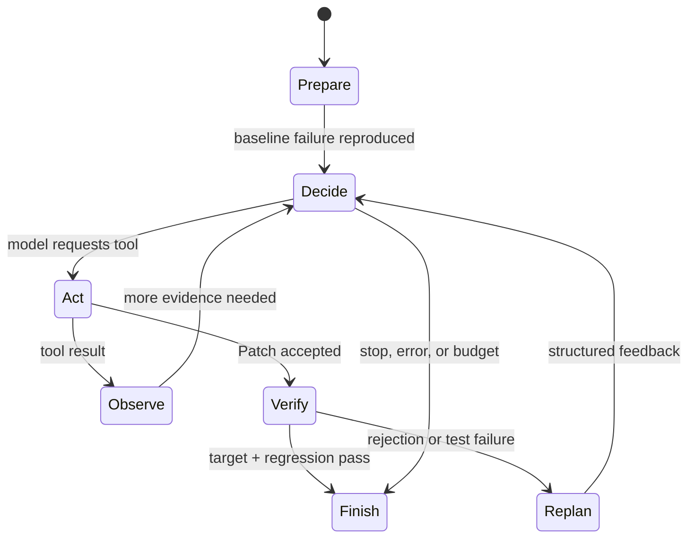

# PatchPilot Agent Runtime

PatchPilot is a single, test-grounded software engineering Agent for bounded Java/Maven
bug repair. The model chooses actions; the environment owns isolation, policy, execution,
rollback, evidence, budgets, and the final status.

## Agent loop

The runtime exposes the existing execution as seven deterministic display phases:

1. **PREPARE** creates a detached worktree at the Case's fixed commit and proves that the
   selected target JUnit test fails for the expected behavior.
2. **DECIDE** sends the complete provider-independent conversation and six strict tool
   schemas to the configured model.
3. **ACT** executes exactly one requested tool through `ToolExecutor`.
4. **OBSERVE** returns the bounded structured result to the same conversation.
5. **VERIFY** automatically runs the configured target after an accepted Patch, then the
   full regression suite after target PASS.
6. **REPLAN** records that a Patch rejection or failed verification was returned to the
   Agent. It is a display label over public events, not private model reasoning.
7. **FINISH** records deterministic success or bounded termination.

No additional planner or reviewer model exists. The trace renderer consumes the same
events as the runtime and cannot affect tool execution or correctness.

## Model and environment responsibilities

The model receives the public issue, bounded baseline diagnostic, conversation history,
tool observations, and remaining budget evidence. It may select one of these tools:

- `list_files` — bounded repository navigation;
- `search_code` — fixed-string, case-insensitive bounded search;
- `read_file` — a bounded UTF-8 line window;
- `apply_patch` — the existing normalized, policy-checked Git Patch transaction;
- `run_target_test` — only the Case's preconfigured Maven/JUnit selector;
- `git_diff` — bounded candidate statistics and diff observation.

The model cannot invoke a shell, select an arbitrary test command, modify policy, create a
worktree, decide that a test passed, or set `RESOLVED`. Responses API continuation remains
provider-independent through `LLMClient`; stateless providers receive the complete required
conversation on each request.

PatchPilot requests one tool action per model turn. If an OpenAI-compatible endpoint returns
multiple function calls despite `parallel_tool_calls=false`, the adapter retains the first
call and the provider output prefix required for it, excludes the unexecuted calls from
stateless continuation, and records `provider_tool_calls_sequentialized` with only bounded
counts. The first real observation must return to the model before it can choose another
action; PatchPilot never silently batch-executes the extra calls.

The environment validates tool schemas, paths, symlink/reparse containment, allowed file
classes, Patch structure and Git applicability. It executes all subprocesses with argument
arrays, explicit working directories and timeouts. Tests, build files, Maven Wrapper files,
CI, Git metadata, and non-production Java files are rejected before Patch application.

## Automatic verification and rollback

An accepted Patch immediately triggers the target test. Only observed Surefire/JUnit
evidence counts. Target PASS triggers the full regression suite. Both PASS results, an
unchanged verified diff, original-repository integrity, worktree cleanup, and artifact
integrity are required for `RESOLVED`.

When the target or regression suite fails and budget remains, PatchPilot restores the
candidate transaction, verifies that the worktree diff is empty, and returns bounded
failure evidence to the Agent. The next model request is preceded by an
`agent_replan_requested` event with public reasons such as `PATCH_REJECTED`,
`TARGET_TEST_FAILED`, `REGRESSION_FAILED`, and `CANDIDATE_REVERTED`. A rollback failure is
terminal infrastructure failure; execution never continues on unknown repository state.

## Budgets and termination

Cases define independent limits for model turns, tool calls, Patch attempts, target-test
executions, regression executions, API calls, retained outputs, timeouts, and wall-clock
duration. CLI overrides can lower or replace supported run limits. Rejected Patches consume
Patch attempts. Exhaustion produces `AGENT_BUDGET_EXHAUSTED`; a model stop, provider error,
policy rejection, and infrastructure error remain distinct terminal outcomes.

## Trace, live view, and replay

`trace.jsonl` is the canonical Agent history. Every line has a monotonic sequence, UTC
timestamp, event type, status, optional duration, run id, and bounded sanitized metadata.
The optional live observer receives exactly the already-sanitized event written to disk.
If rendering raises, the observer is disabled and Agent execution continues unchanged.

`patchpilot repair --trace-view compact|verbose|off` presents the event stream while the run
executes. The formatter describes requested actions and returned evidence; it never says
that the Agent "thought" something.

Every repair outcome with sufficient trace data generates `trajectory.md`. It contains the
public goal, event-derived timeline, deterministic verification evidence, counters, timing,
and final status. A successful document refers to `final.patch` by artifact-relative name
and SHA-256 rather than embedding it.

`patchpilot replay-run PATH` accepts a run directory, `report.json`, or `trace.jsonl`. It
validates both schemas, sequence ordering, run ids, final-status consistency, path
containment, artifact sizes, and hashes. Replay performs no model request, Git mutation,
Maven execution, or network request. Text and Markdown replay use the same semantic event
projection as the live observer.

Per-run reports serialize artifact references relative to the directory containing
`report.json`. Moving the complete directory therefore preserves replay while size and SHA-256
remain authoritative. Legacy all-absolute reports are remapped only as one coherent run with
matching local identity evidence; traversal and symlink/junction escape remain invalid.

## Why no multi-agent framework is required

The current scope has one decision maker, six local tools, a bounded synchronous loop, and
one deterministic verifier. A multi-agent framework would add coordination state without
changing the correctness oracle or the required behavior. PatchPilot keeps the provider
boundary small and the runtime directly testable.

## Hidden reasoning policy

PatchPilot does not request, store, render, or reconstruct hidden chain-of-thought.
Provider-internal reasoning items required for protocol continuation may remain in memory,
but are not written to reports, traces, trajectories, or CLI output. Reasoning token counts
may be recorded when the provider exposes them. Raw Patch bodies, complete source files,
complete Maven logs, API credentials, authorization headers, hidden golden Patches, and
validation-only metadata are also excluded from trajectory events.
