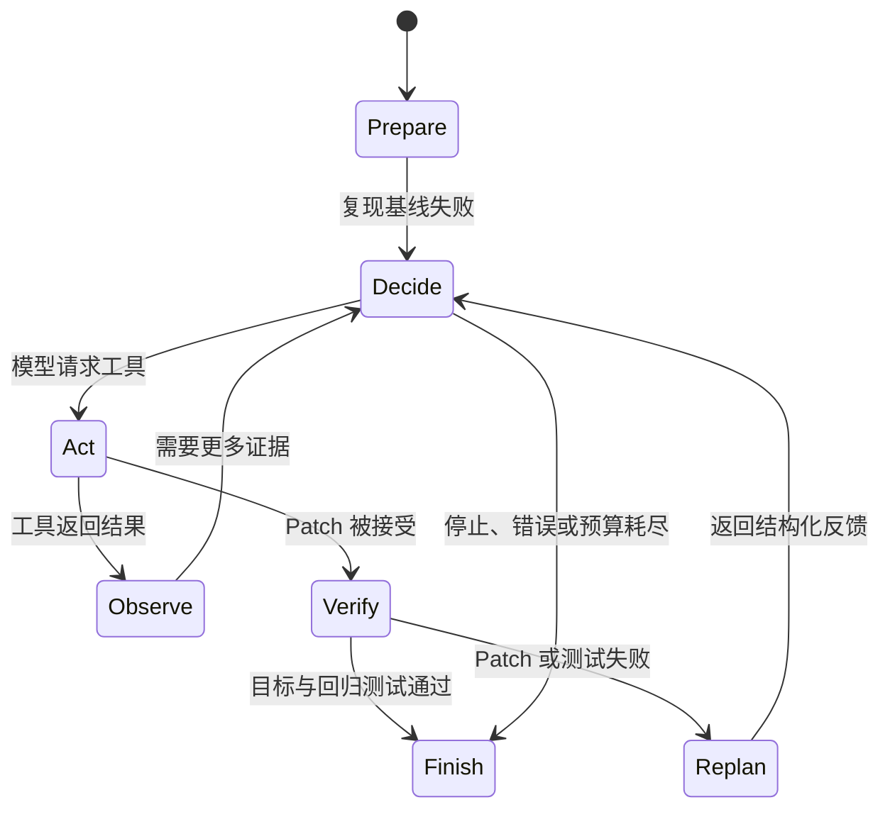

# RepoSuture Agent 运行时

RepoSuture 是一个面向有界 Java/Maven 缺陷修复、以测试为依据的单 Agent Runtime。模型选择动作；环境负责隔离、策略、执行、回滚、证据、预算和最终状态。

## Agent 循环

运行过程映射为七个确定性的可见阶段：

1. **PREPARE**：在 Case 的固定 Commit 上创建 detached worktree，并证明指定 JUnit 目标测试因预期行为失败。
2. **DECIDE**：将完整的 Provider 无关对话和六个严格工具 Schema 发送给模型。
3. **ACT**：通过 `ToolExecutor` 执行一个模型请求的工具。
4. **OBSERVE**：把有界、结构化结果返回同一段对话。
5. **VERIFY**：Patch 被接受后自动执行目标测试；目标 PASS 后自动执行回归范围。
6. **REPLAN**：记录 Patch 拒绝或验证失败已反馈给 Agent。它只是公开事件的展示标签，不代表私有推理。
7. **FINISH**：记录确定性成功或有界终止。

系统中没有额外的 Planner 或 Reviewer 模型。轨迹渲染器只消费 Runtime 已写入的同一事件流，不能影响工具执行或正确性。

## 模型与环境的职责

模型接收公开 Issue、基线诊断、对话历史、工具观察和剩余预算，可选择：

- `list_files`：有界仓库导航；
- `search_code`：固定字符串、不区分大小写的有界搜索；
- `read_file`：读取有界 UTF-8 行窗口；
- `apply_patch`：提交经过规范化、策略检查的 Git Patch 事务；
- `run_target_test`：只执行 Case 预先配置的 Maven/JUnit Selector；
- `git_diff`：查看有界候选统计与差异。

模型不能执行 Shell、选择任意测试命令、修改策略、创建 worktree、自行判定测试通过或设置 `RESOLVED`。Responses API 续接通过 Provider 无关的 `LLMClient` 完成；无状态 Provider 的每次请求都包含继续执行所需的完整历史。

RepoSuture 每轮只执行一个工具动作。如果 OpenAI-compatible Endpoint 在 `parallel_tool_calls=false` 时仍返回多个 Function Call，适配器只保留第一个调用及其所需输出前缀，后续未执行调用不会进入无状态续接，并通过 `provider_tool_calls_sequentialized` 记录有界计数。模型必须先看到第一个真实观察，才能决定下一步。

环境负责校验工具 Schema、路径、symlink/reparse containment、允许文件类型、Patch 结构与 Git 适用性。所有子进程都使用参数数组、显式工作目录和超时。测试、构建文件、Maven Wrapper、CI、Git 元数据和非生产 Java 文件会在 Patch 应用前被拒绝。

## 自动验证与回滚

Patch 被接受后立即执行目标测试，只有 Surefire/JUnit 证据有效。目标 PASS 后执行配置的回归范围。目标与回归均 PASS、最终 diff 合规、原始仓库不变、worktree 清理成功且产物完整，才能得到 `RESOLVED`。

如果目标或回归失败且仍有预算，RepoSuture 会：

1. 回滚本次候选事务；
2. 验证 worktree diff 为空；
3. 将有界失败证据返回 Agent；
4. 在下一次模型请求前写入 `agent_replan_requested`。

公开的重新规划原因包括 `PATCH_REJECTED`、`TARGET_TEST_FAILED`、`REGRESSION_FAILED` 和 `CANDIDATE_REVERTED`。回滚失败属于终止性基础设施错误；系统不会继续操作状态未知的仓库。

### 单候选无反馈模式

`single-candidate-no-feedback` 只用于受控消融，不是另一套 Agent Runtime。模型仍可使用正常的只读探索工具，但最多提交一个 Patch：

- Patch 被拒绝时直接结束；
- Patch 被接受后仍执行真实目标与回归验证；
- Patch 后的验证结果不返回模型；
- 不产生 `REPLAN`；
- 不允许第二个候选。

两种模式使用相同 Provider、Case、工具、策略、测试与正确性判据。Release 0.4 的六 Case DeepSeek 实验中，`full-agent` 解决 6/6，`single-candidate-no-feedback` 解决 3/6。该结果是小样本工程证据，不是因果证明。详见[反馈消融报告](results/reposuture-feedback-ablation-deepseek.md)。

## 预算与终止

Case 可以独立限制：

- 模型轮数与请求数；
- 工具调用；
- Patch 尝试；
- 目标与回归执行次数；
- API 调用；
- 输出保留量；
- 测试和总墙钟超时。

被拒绝的 Patch 仍消耗一次 Patch 尝试。预算耗尽产生 `AGENT_BUDGET_EXHAUSTED`；模型停止、Provider 错误、策略拒绝和基础设施错误保持独立终止结果。

报告分别记录：

- `terminal_status`：循环如何结束；
- `primary_failure`：统一分类器给出的最强主要原因；
- `observed_failures`：按顺序去重的全部相关事件。

后出现的搜索错误或预算终止不会擦除更强的目标或回归证据。

## 轨迹、实时展示与重放

`trace.jsonl` 是唯一权威的 Agent 历史。每一行包含单调递增 Sequence、UTC 时间、事件类型、状态、可选耗时、Run ID 和有界脱敏元数据。可选实时 Observer 只接收已经写入磁盘的脱敏事件；渲染异常会禁用 Observer，但不会改变 Agent 执行结果。

`reposuture repair --trace-view compact|verbose|off` 在运行时展示该事件流。渲染器只描述已请求动作和返回证据，不声称 Agent “想了什么”。

每次具备足够 Trace 的运行都会生成 `trajectory.md`，其中包含：

- 公开目标；
- 由事件派生的时间线；
- 确定性验证证据；
- 预算、计数与耗时；
- 最终状态。

成功轨迹只通过相对路径和 SHA-256 引用 `final.patch`，不会嵌入 Patch 正文。

`reposuture replay-run PATH` 接受运行目录、`report.json` 或 `trace.jsonl`。它会校验 Schema、Sequence、Run ID、终态一致性、路径 containment、文件大小和 SHA-256。重放不会请求模型、修改 Git、执行 Maven 或访问网络；文本与 Markdown 输出使用和实时 Observer 相同的语义投影。

新报告中的产物引用相对于 `report.json` 所在目录，因此完整运行目录移动后仍可重放。旧版全绝对路径报告只有在其引用共同属于同一运行，且本地文件身份、大小和哈希一致时才会安全重映射。路径穿越与 symlink/junction 逃逸仍然无效。

## 为什么不需要多 Agent 框架

当前问题只有一个决策者、六个本地工具、一个有界同步循环和一个确定性验证器。引入多 Agent 框架会增加协调状态，却不会改变正确性判据或当前行为。保持较小的 Provider 边界能让 Runtime 更容易直接测试和审计。

## 隐藏推理策略

RepoSuture 不请求、存储、渲染或重建隐藏 Chain-of-Thought。Provider 协议续接所需的内部 Reasoning Item 可暂存于内存，但不会写入报告、Trace、Trajectory 或 CLI 输出。Provider 明确提供时，只记录 Reasoning Token 数量。

轨迹事件同样不包含原始 Patch、完整源码、完整 Maven 日志、API 凭据、Authorization Header、Golden Patch 或仅供验证的隐藏元数据。
